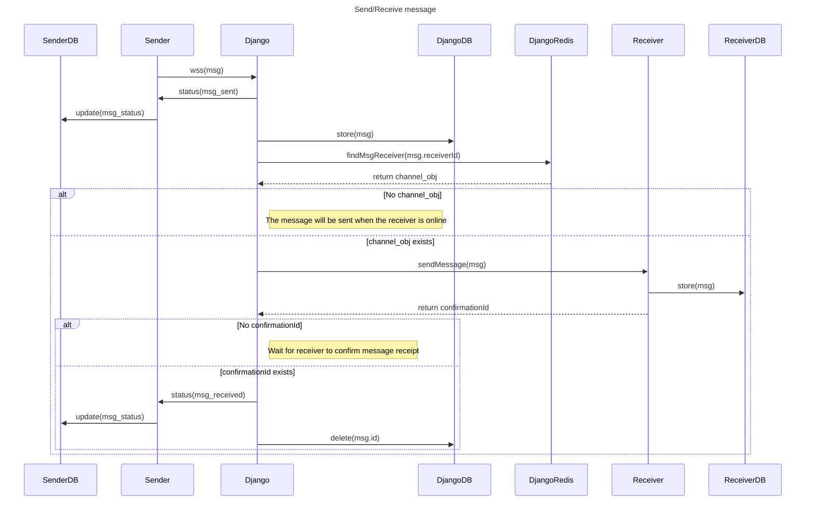

# NUNTIUS

A local-first mobile messaging app. The goal is to not store messages in the server.

## Tech Stack

**Client:** React Native, EXPO, SQLite3

**Server:** Python 3.12, Django, Redis, Postgres, Daphne

**IAAS:** Azure, AWS, (Terraform)

## Project Configuration (Run locally or Cloud deployment)

### Backend 

[docker-compose.yaml](docker-compose.yaml) file already contains all the default variables for development set up.

you can modify as needed, for example if you already have containers or services running on the ports that are going to be used.

```
docker compose up --build
```

#### Allow social login (OPTIONAL)

> [!IMPORTANT]
> If you want to use Google Authentication, you will need to access django admin and create a new Social application.

first shutdown docker compose.

```
docker compose down
```

Modify [docker-compose.yaml](docker-compose.yaml) adding a new port forwarding between web (django) container and your host machine.

For example:

```yaml
    ports:
      - "8000:8000"
      - "8899:8899" # try one that is available both on the container and on host: <host>:<container>
```

run docker compose again.

```
docker compose up --build
```

```sh
# access django container
docker-compose exec web bash # web is the django container name

# create superuser
python manage.py createsuperuser

# run django with runserver using the correct port
python manage.py runserver 0.0.0.0:8899
```

On host machine access `http://localhost:8899/admin` and add Social applications

after that you can close the runserver, run compose down, and rebuild again without the additional port forwarding

> [!NOTE]
> For more experienced users, the above may be achieved using `manage.py shell` and creating the object

#### Allow images, audio, videos and files upload (OPTIONAL)

To support these features you will need to follow the `#Support for file upload` at [Terraform](terraform/README.md) Readme file

#### Alternative Backend (Run Django on host machine)

> [!NOTE]
> This steps only apply if you don't want to run Django on a container

- run only Postgres and Redis containers.
- open [Backend](backend/README.md) and follow steps

### IAAS

Deploy backend infrastructure using Azure & AWS with Terraform script.

Follow instructions at [Terraform](terraform/README.md)

### Frontend

Open [Frontend](frontend/nuntius/README.md) instructions for building the Expo app.

## Features

### Send/Receive message flow



## API Reference

TODO

## Authors

- [@pablonicolla](https://github.com/PabloNicolla)